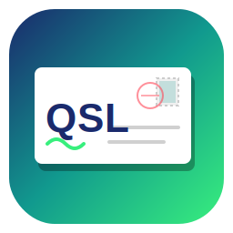
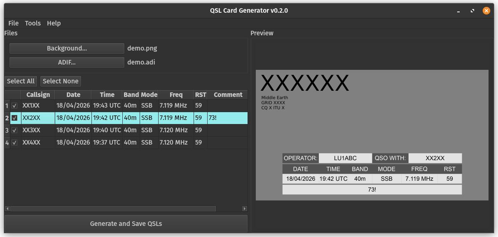

<h1 align="center">
  <br>
  QSL Card Generator
</h1>

<p align="center"> 

</p>

A desktop application for amateur radio operators designed to generate QSL cards in bulk from ADIF log files. Built with Python, PyQt6, and Pillow.



## Download

Prebuilt executables for Windows, Linux are available in the latest [GitHub Releases](https://github.com/igonzalezb/QSL-Card-Generator/releases/latest)

## Features

* **ADIF Import:** Load contacts directly from your favorite logging software.
* **Live Preview:** See your QSL card updates in real time, including smooth mouse-wheel zoom.
* **Highly Customizable:**

  * Change table background and text colors.
  * Adjust transparency for seamless blending with the background image.
  * Choose from 7 predefined table positions (top, bottom, left, right, center, etc.).
* **Manual Editing:** Edit contact data directly in the table, add new QSOs manually, or remove unwanted entries.
* **Fast Batch Export:** Uses multithreaded background processing (`QThread`) to export hundreds of QSL cards quickly without freezing the UI.
* **Multilingual:** Built-in support for English and Spanish, with automatic system language detection.
* **Settings Persistence:** Saves your callsign, colors, and preferences for future sessions.

## Project Structure

```text
QSL-Card-Generator/
├── main.py                 # Application entry point
├── qsl_design.ui           # Qt Designer UI file
├── requirements.txt        # Project dependencies
├── core/                   # Core logic
│   ├── engine.py           # Image rendering engine (Pillow)
│   ├── exporter.py         # Background processing threads
│   └── i18n.py             # Internationalization system
├── ui/                     # UI controllers
│   ├── main_window.py      # Main window
│   └── settings_dialog.py  # Settings dialog
└── locales/                # Language files
    ├── en.json
    └── es.json
```

## Build Executable

To create a standalone executable using PyInstaller:

```bash
pip install pyinstaller
python build.py
```
## ToDos
- [X] Fix ADIF importer to handle edge cases and malformed files more gracefully.
- [ ] Add default empty card template.
- [X] Auto resize background image to fit the card dimensions.
- [ ] Add comments to QSL card.
- [ ] Change table size (scale).
- [X] Zoom using touchpad scrolling.
- [ ] Right-click context menu for zooming and resetting zoom in the preview.
- [ ] Add call sign on the card.
- [ ] Add options for setting zones, grid squares, and other QSO details on the card.
- [ ] Add support for exporting QSL cards in various formats.

## Disclaimer

This is a personal project developed for the amateur radio community.  
Feedback, suggestions, and contributions are always welcome!

---

**73 and good DX!**
