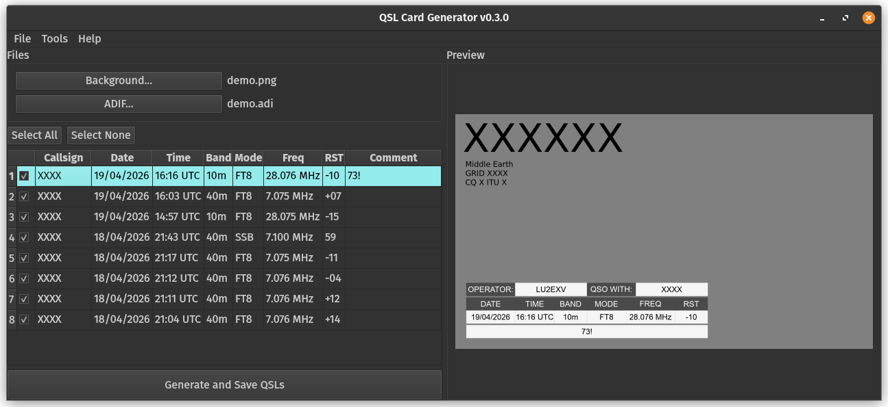
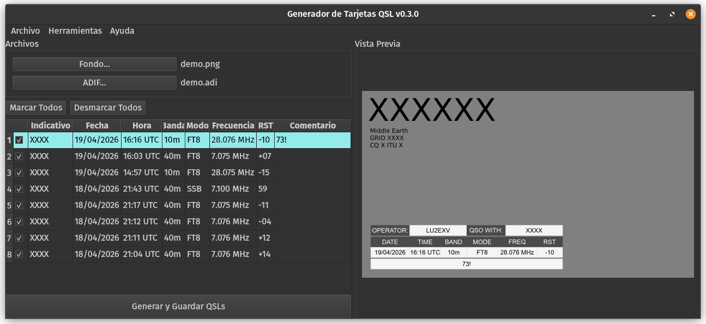

A desktop application for amateur radio operators designed to generate QSL cards in bulk from ADIF log files.
Built with Python, PyQt6, and Pillow.

  

<h2>Features</h2>

<ul>
  <li><strong>ADIF Import:</strong> Load contacts directly from your favorite logging software.</li>

  <li><strong>Live Preview:</strong> See your QSL card updates in real time.</li>

  <li>
    <strong>Highly Customizable:</strong>
    <ul>
      <li>Change table background and text colors.</li>
      <li>Adjust transparency for seamless blending with the background image.</li>
      <li>Choose from 7 predefined table positions (top, bottom, left, right, center, etc.).</li>
    </ul>
  </li>

  <li><strong>Manual Editing:</strong> Edit contact data directly in the table.</li>

  <li><strong>Fast Batch Export:</strong> Uses multithreaded background processing (<code>QThread</code>).</li>

  <li><strong>Multilingual:</strong> English and Spanish support with automatic detection.</li>

  <li><strong>Settings Persistence:</strong> Saves your preferences for future sessions.</li>
</ul>

<h2>Disclaimer</h2>

This is a personal project developed for the amateur radio community.
Feedback, suggestions, and contributions are always welcome!

<strong>73 and good DX!</strong>

Una aplicación de escritorio para radioaficionados diseñada para generar tarjetas QSL en masa a partir de archivos de registro ADIF.
Construida con Python, PyQt6 y Pillow.

  

<h2>Características</h2>

<ul>
  <li><strong>Importación ADIF:</strong> Carga contactos directamente desde tu software favorito.</li>

  <li><strong>Vista Previa en Vivo:</strong> Ve los cambios en tiempo real.</li>

  <li>
    <strong>Altamente Personalizable:</strong>
    <ul>
      <li>Cambia colores de fondo y texto.</li>
      <li>Ajusta la transparencia.</li>
      <li>Elige entre 7 posiciones predefinidas.</li>
    </ul>
  </li>

  <li><strong>Edición Manual:</strong> Edita contactos directamente en la tabla.</li>

  <li><strong>Exportación Rápida:</strong> Usa procesamiento multihilo (<code>QThread</code>).</li>

  <li><strong>Multilingüe:</strong> Soporte para inglés y español.</li>

  <li><strong>Persistencia:</strong> Guarda preferencias automáticamente.</li>
</ul>

<h2>Disclaimer</h2>

Este es un proyecto personal desarrollado para la comunidad de radioaficionados.
¡Las sugerencias y contribuciones son bienvenidas!

<strong>73 y buen DX!</strong>

